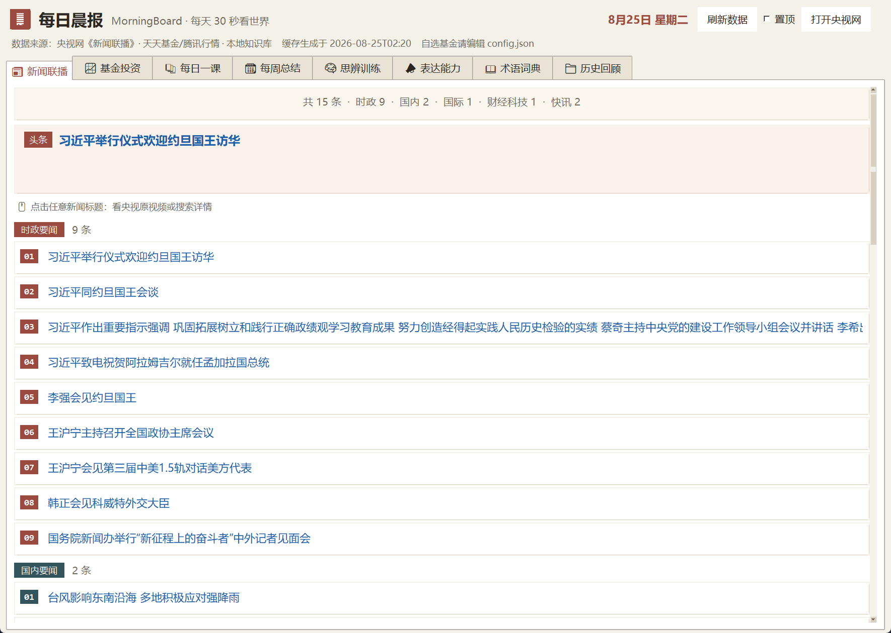
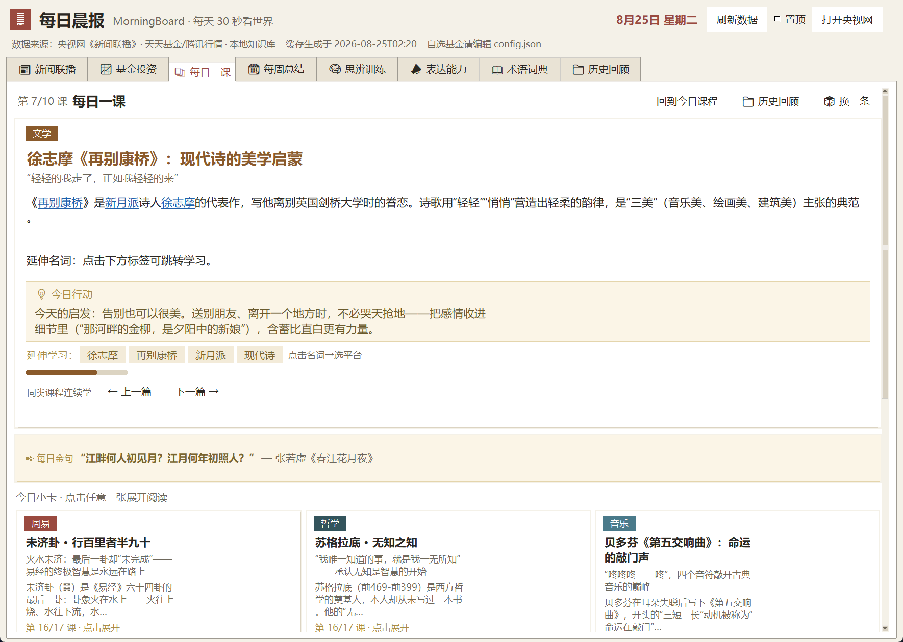
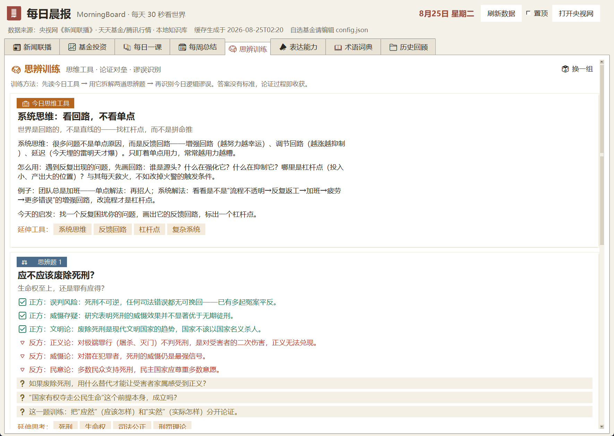

# 🌅 MorningBoard · 每日播报

> **晚上 8 点，把今天值得看的信息，整理成一屏，自动送到你面前。**

每晚《新闻联播》（19:00）播完、基金净值刚出齐，MorningBoard 就自动从公开接口收集信息、生成当日汇总，并弹出一屏莫兰迪配色、可滚动的卡片播报：**新闻联播完整节目单 · 四源科技要闻 · 你自选基金的涨跌 · 一节 AI 每日一课 · 一个思辨题 · 一组新术语**。你什么都不用做，只负责双击打开。

装机一次，它每晚 20:00 自动更新、自动弹出；电脑关机错过会自动补跑。想要"晚上吃完饭扫一眼今天发生了什么、学了什么"——这就是给你的那扇窗。

> **🇬🇧 In English** — **MorningBoard** is a Windows desktop *daily briefing* app. After the CCTV evening news airs (19:00 daily), it auto-collects and pops up a one-screen, scrollable dashboard: tonight's CCTV news program, top tech headlines (InfoQ / IT 之家 / 量子位 / 掘金), your watched funds' NAV + mini trend charts, an AI-written daily lesson, a thinking & expression exercise, a term dictionary (incl. MCP / RAG / AI agent / embodied AI), and a weekly recap. Pure Python stdlib + tkinter, no third-party deps, optional DeepSeek AI, one-click Windows install. *(Note: the UI and all content are Chinese-oriented.)*

---

## ✨ 特点

| 板块 | 内容 | 数据来源 |
| --- | --- | --- |
| 📰 **新闻联播** | 当晚完整节目单，自动按 **时政/国内/国际/财经科技/快讯** 分组，头条高亮 + 分类统计 | 央视网 tv.cctv.com |
| ⚡ **科技前沿** | **4 信源聚合**：InfoQ（深度）→ IT 之家（综合）→ 量子位（AI 前沿）→ 掘金（开发者热榜），按内容深度排序、逐条标注来源，失败源自动跳过 | InfoQ / IT 之家 / 量子位 / 掘金 |
| 📈 **基金投资** | 大盘指数 8 项卡片、市场强弱横幅、**今日基金涨幅榜**、自选基金净值 + **迷你走势图** + 日涨跌/近 1 周/1 月/3 月收益 | 天天基金 / 腾讯 / 新浪 多源备援 |
| 📚 **每日一课** | **13 类轮换**（周易/哲学/文学/音乐/毛选/心理学/美学/摄影/经济学/历史/茶艺/礼仪/官场文化），每日主课 + 小卡 + 每日金句；配置 `DEEPSEEK_API_KEY` 后由 **AI 当日生成**（无 key/失败自动回退静态库） | 本地知识库 + DeepSeek API |
| 🧠 **思辨训练** | 思维工具 + 思辨题对垒 + 谬误雷达；**AI 生成当日思辨题**（无 key 回退静态库） | 本地知识库 + DeepSeek API |
| 📣 **表达能力** | 每日一课表达技巧；**AI 生成当日表达课**（无 key 回退静态库） | 本地知识库 + DeepSeek API |
| 📖 **术语词典** | 20+ 领域术语库，可搜索、按领域筛选，含 **MCP / RAG / 智能体 / 具身智能** 等 AI 新术语；术语可点击跳转延伸学习 | 本地知识库 |
| 🗓 **每周总结** | 每周日 20:00 生成：本周 8 指数周涨跌 + 本周联播按 **金融/AI 科技/医学/科学/国际局势/民生** 六大主题归档 + 多源科技要闻 | 腾讯周K + 央视网节目单 |

界面为 **tkinter 圆角卡片风格**：莫兰迪配色、悬停高亮、涨红跌绿、可滚动。**仅标准库 + tkinter，无第三方依赖、无 API Key、无账号体系。**

---

## 🖼 预览

**📰 新闻联播** —— 当晚央视《新闻联播》完整节目单，按 时政/国内/国际/财经科技/快讯 分组，头条高亮 + 分类统计



**📚 每日一课** —— 13 类知识轮换，每日主课 + 金句 + 小卡 + 可点名词延伸学习（配置 DeepSeek API 后为 AI 每日生成）



**🧠 思辨训练** —— 今日思维工具 + 论证对垒思辨题 + 谬误雷达



> 界面为 tkinter 圆角卡片风格：莫兰迪配色、悬停高亮、涨红跌绿、可滚动。

---

## 🚀 快速开始

**只要装过 Python 3.10+（自带 tkinter），一步到位：**

> 双击 **`一键安装.bat`** —— 自动检测 Python、注册每晚 20:00 计划任务、创建桌面「每日播报」快捷方式，全程中文提示。
> 没装 Python？脚本会提示并帮你打开 python.org 下载页（勾选默认选项即含 tkinter）。

手动等效命令（供排查）：

```powershell
powershell -ExecutionPolicy Bypass -File .\install_autostart.ps1
```

安装后立即验证：双击桌面「每日播报」，或运行：

```powershell
python morning_evening.py   # 生成 + 弹窗一次
```

> 任务计划：**`MorningBoard-Generate`**（每天 20:00，联播播完后生成并自动弹窗，错过自动补跑；不再开机自动弹窗）。
> 想立刻看：双击桌面「每日播报」（只读本地缓存，秒开；缓存过期会自动后台刷新）。

---

## 🎨 运行原理

```
每天 20:00（定时任务）── 联播19:00播完+净值出齐后 收集信息 ──▶ 生成 cache/today.json ──▶ 自动弹出播报窗口
随时想看：双击桌面「每日播报」快捷方式（只读缓存，秒开）
```

- 播报**当晚 19:00 刚播完**的《新闻联播》+ 当日最新基金净值；
- 每晚 20:00 任务生成后直接弹窗展示；**电脑关机错过会自动补跑**；
- 窗口打开**只读本地缓存**，不卡网络；缓存过期或联播日期落后时后台静默刷新；
- 全部数据来自**公开接口**，无 API Key、无外部依赖。

---

## 🤖 开启 AI 每日生成（可选，强烈推荐）

设置环境变量 `DEEPSEEK_API_KEY`（[DeepSeek 开放平台](https://platform.deepseek.com/) 申请的 Key）后，**每日一课主课、思辨题、表达课**会改为 **AI 每日现生成**——内容每天全新、深度可调，彻底告别"内容有限"。

```powershell
# 永久设置（PowerShell）
[Environment]::SetEnvironmentVariable("DEEPSEEK_API_KEY", "sk-你的Key", "User")
```

- 不配置 / Key 失效 / 网络失败 → **自动降级**为静态知识库轮换，程序照常运行；
- 可在 `config.json` 的 `ai` 段调整：模型名（默认 `deepseek-chat`）、接口地址、超时；
- AI 生成约需 30~60 秒（每晚定时任务在联播播完后执行，不影响使用）。

---

## 📁 目录结构

```
MorningBoard/
├── morning_evening.py    每晚入口：收集信息 + 生成缓存 + 自动弹出（定时任务调用）
├── morning_show.py       展示窗口入口（桌面快捷方式指向它）
├── morning_generate.py   仅生成缓存（调试用）
├── config.json           自选基金、指数、新闻条数、AI 配置
├── knowledge/            知识库（13 类 + 术语 + 金句，可自行增删条目）
├── app/                  核心代码（抓取/生成/GUI）
│   ├── config.py            配置
│   ├── fetch.py             多源抓取（联播/科技/基金/指数）
│   ├── generate.py          生成当日汇总
│   ├── knowledge.py         知识库加载
│   ├── ai_gen.py            DeepSeek AI 每日生成
│   ├── terms_updater.py     术语库/AI 扩充
│   └── ui/                  界面（模块化拆分）
│       ├── theme.py         配色/字体/常量
│       ├── widgets.py       通用控件（圆角卡片/滚动/迷你走势图）
│       ├── app.py           MorningApp 主类（组合各标签页）
│       └── tabs/            各标签页模块（news/funds/lesson/thinking/expression/weekly/terms/history）
├── cache/                生成缓存（运行时生成，不入库）
├── 一键安装.bat           双击即装（推荐）：检测 Python + 注册每晚任务 + 建桌面快捷方式
├── install_autostart.ps1 安装引擎（被 一键安装.bat 调用）
├── uninstall_autostart.ps1 卸载
├── make_share.ps1        一键打包「分享版」zip（不含个人缓存）
└── run_now.bat           手动弹出一次
```

---

## ⚙️ 配置

**自选基金**：编辑 `config.json` 的 `funds` 列表（6 位基金代码，如 `"161725"`）。

> 已内置 5 只示例：161725 招商中证白酒、003095 中欧医疗健康、005827 易方达蓝筹精选、110020 易方达沪深300联接A、000001 华夏成长。

**扩充知识库**：`knowledge/` 下每个 JSON 是数组，每条格式：

```json
{"t": "标题", "s": "一句话概括", "b": ["白话讲解", "生活启示"], "links": ["名词1", "名词2"]}
```

- `links` 是可点击的"延伸学习"名词，点击选平台（百度百科/B站/知乎/微信搜一搜）跳转；
- 金句库 `quotes.json` 格式：`{"t": "金句", "s": "出处/作者"}`；
- 新增条目无需改代码；每日课程按日期轮转，自动包含新条目。

---

## 🙋 常见问题

- **晚上没弹窗**：`schtasks /Query /TN MorningBoard-Generate`，或双击桌面快捷方式看报错。
- **想看昨天的**：双击桌面快捷方式（显示缓存，过期会后台自动刷新）。
- **换了 Python**：重跑 `install_autostart.ps1`，或用 `-PythonPath C:\你的\python.exe` 指定。
- **新闻为空**：联播每天 19:00 播出，早间自动回退前一晚；连续为空多半是央视网改版，提 issue 即可。
- **指数/基金为空**：已内置东财→腾讯→新浪三重备援；全失败会显示原因并保留旧数据，不白屏。
- **中文乱码**：所有文件统一 UTF-8，勿用记事本"另存为 ANSI"。

---

## ⚠️ 免责声明

本工具仅用于个人学习与信息聚合，所有数据来自公开网络接口（央视网、天天基金、腾讯、新浪、InfoQ、IT 之家、量子位、掘金、DeepSeek API 等），**版权归原站所有**。请遵守各数据源的条款，勿用于商业用途。本项目不承担因使用造成的一切责任。

---

## 🆚 技术亮点（为什么值得一看）

- **零依赖**：只用 Python 标准库 + tkinter，跑在任何装有 Python 的 Windows 上；
- **多源备援**：同一条数据（指数/基金/新闻）配置多个上游，失败自动切换，永不白屏；
- **AI 增强**：无 Key 也能用，有 Key 自动升级为「每日现生成」内容；
- **一键安装**：`.bat` + 计划任务 + 桌面快捷方式，小白也能 30 秒装好；
- **完全可扩展**：知识库是纯 JSON，加条目即可扩充；板块/来源都可自行增改。

---

## 📄 License

[MIT](LICENSE) © MorningBoard contributors
